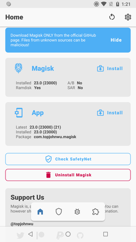

Nexus 5x (with ram disk) + Pixel4 (with ram disk)
=================================================

## Fast-track rooting for Pixel4 tablet (2025)
Proceed with normal path; download firmware from Google, patch it with Magisk [using normal path](https://topjohnwu.github.io/Magisk/install.html).
1. Let's assume bootloader is unlocked, if not, see [this article from Google](https://developers.google.com/android/images#flashtool)
1. Download [official firmware](https://developers.google.com/android/images)
1. Unzip `init_boot.img` (not `boot.img` !)
1. Install Magisk from [Github-releases](https://github.com/topjohnwu/Magisk)
1. Push image: `adb push init_boot.img /sdcard/Download`
1. Patch with Magisk
1. Pull patched image: `adb pull /sdcard/Download/magisk_patched-<random_string>.img`
1. Reboot: `adb reboot bootloader`
1. Flash: `fastboot flash init_boot images/magisk_patched-<random_string>.img`
1. Reboot and open Magisk, done!

## Fast-track unbricking Pixel4 tablet (2025)
Let's assume something went wrong with flashing, here we fscked up `slot b` (default) flashing
1. Download [official firmware](https://developers.google.com/android/images)
1. Reboot: `adb reboot bootloader`
1. Run `fastboot getvar current-slot`, should respond with `slot b` (if not, don't proceed)
1. Run `fastboot --set-active=a` (slot should change to 'a')
1. Reboot to recovery using slot a: `fastboot reboot recovery`
1. First press `Power` and then `Volume up` (opens Recovery Menu)
1. From Recovery Menu, select `Apply update from ADB`
1. Run `adb sideload <downloaded factory image zip>`
1. Reboot: `adb reboot bootloader`, slot 'b' should be now active
1. Start normally and done!

## Fast-track Pixel4
1. If Android gets upgraded (via android update system), root is lost
1. Reboot after update and Magisk root is gone
1. Proceed with normal path; download firmware from Google, patch it with Magisk [using normal path](https://topjohnwu.github.io/Magisk/install.html)


## Bricked device (works for Pixel4)?
1. Download OTA zip
1. Unzip zip twice (to show all img files) to `./image` for example and `cd image`
1. This could erase everything --> Run from root dir of zip: `ANDROID_PRODUCT_OUT=/home/tk0/android/firmware/flame-tp1a.220624.014/image/ ./flash-all.sh`

## Bricked device (Nexus)?
This should fix MOST of the issues, via https://android.stackexchange.com/a/232528

Here are the essential steps, more detailed information is in the links above:

1. Download the OTA ZIP file from the above page, and know where it is located but do NOT unzip the file. Note you should always select the newest one listed for your device which will typically be at the bottom of your device section.
1. Boot your device into fastboot mode and connect the USB cable
1. Select Recovery from the menu and press POWER to select it. Wait for the Android logo with a red Exclamation mark to appear on the screen
1. Access the recovery menu with POWER+VOL UP
1. Select Apply update from ADB from the menu and press POWER
1. Test your USB connection with adb devices which should output your device with sideload next to it. If the result is anything else, you need to troubleshoot your USB connection or software installation before continuing.
1. Enter adb sideload ota_file.zip where ota_file.zip is the full path and filename of the OTA ZIP file you downloaded previously
1. The device will download and verify the file, then flash it to your device, then make that software "slot" active. If all goes well, after several minutes a success confirmation will be displayed and you will be presented with a menu.
1. Select Reboot system now and wait for the phone to boot up fully.

## Prepare boot.img
1. download stock firmware: https://dl.google.com/dl/android/aosp/bullhead-opm7.181205.001-factory-5f189d84.zip (latest for Nexus 5x), https://developers.google.com/android/images#flame (Pixel 4)
1. unzip stock firmware
1. unlock OEM (from developer menu)
1. reboot to bootloader: `adb reboot bootloader`
1. unlock flashing: `fastboot flashing unlock`
1. flash stock firmware all (boot, recovery, etc.): `$ ./flash-all.sh` (wipes all data!)
1. install magisk: https://topjohnwu.github.io/Magisk/install.html
1. extract boot.img from factory image and push to device:

```
$ cd firmware/bullhead-opm7.181205.001
$ unzip image-bullhead-opm7.181205.001.zip -d image-bullhead-opm7.181205.001
$ adb push image-bullhead-opm7.181205.001/boot.img /sdcard/Download
```

## TWRP (bullhead / nexus, don't use for Pixel)
If TWRP (enhanced recovery) is needed do the following:
1. reboot phone using POWER+VOLUMEDOWN
1. run `adb flash recovery twrp.img` (img downloaded from twrp site)

## Install Magisk boot.img
1. open magisk, press `Magisk -> install` and select option `Select and Patch a file` to patch uploaded file `/sdcard/Download/boot.img`
1. download patched, e.g. `$ adb pull /sdcard/Download/magisk_patched-23000_ESlfM.img`
1. `$ adb reboot bootloader`
1. `$ fastboot flash boot magisk_patched-23000_ESlfM.img`
1. `$ fastboot reboot`
1. open magisk, should look like:

    

1. done & simple test:
```
$ adb devices; adb shell "su -c id"
List of devices attached
00<DEVICEIDHERE>	device

uid=0(root) gid=0(root) groups=0(root) context=u:r:magisk:s0

```
**note1:** If above fails or superuser is missing _after reboot_, try the following:
* Install Magisk image via TWRP (recovery) and reboot
* Magisk will complain 'invalid permissions or something' and then fix this using Magisk Direct install

**note2:** If using Pixel Tablet (android 13) - use `init_boot.img` instead of `boot.img`, otherwise same process

## Disable certificate validation (pinning) using Magisk
1. Download latest [ MagiskTrustUserCerts](https://github.com/NVISOsecurity/MagiskTrustUserCerts)
1. upload `adb push alwaystrustusercerts.zip /sdcard/Download`
1. Install via Magisk modules
1. Reboot device
1. Add some certificate into Android 'user credentials' store (via sdcard)
1. Reboot and certificate is moved into System Trust Store
1. Done

## Install Nethunter for Android
1. Download latest [NetHunter](https://www.kali.org/docs/nethunter/)
1. Install using TWRP (via recovery) and reboot
1. Approve superuser to NetHunter via Magisk
1. Follow post-install from [NetHunter post-install](https://www.kali.org/docs/nethunter/)
