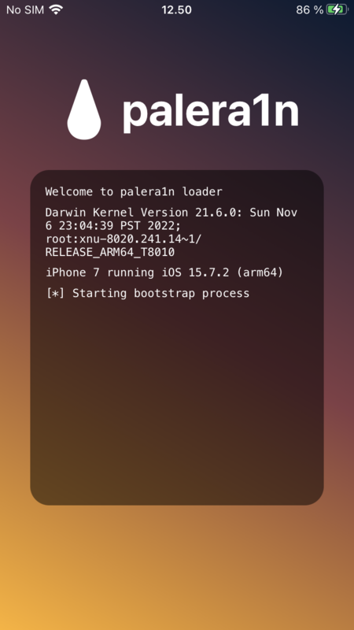
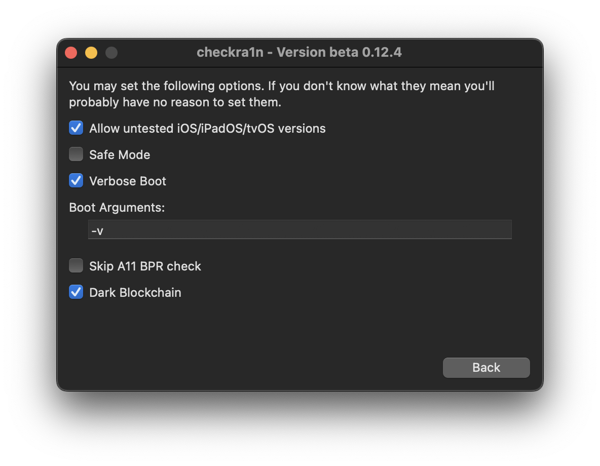

# iOS


## Jailbreaking: Palera1n iOS 15.7.3
*Using iPhone7 with iOS 15.7.3*

<TODO PICTURE>

1. (ALWAYS DO THIS 1st!) Old tweaks removed: `sudo ./palera1n.sh --restorerootfs 15.7.2 --tweaks`. At some point same failure as before with 15.7.2 (see below) and `iproxy -s 127.0.0.1 6413:22` in another terminal fixed it
1. iPhone7 had pairing problems and could not be recognized, `idevicepair pair` fixed this:
 ```
...
[*] Waiting for devices
[*] Detected normal mode device
ERROR: Could not connect to lockdownd: Invalid HostID (-21)
ERROR: Could not connect to lockdownd: Invalid HostID (-21)
ERROR: Could not connect to lockdownd: Invalid HostID (-21)
...
 ```
1. iPhone7 was upgaded from 15.7.2 -> 15.7.3
1. Install new: `sudo ./palera1n.sh --tweaks 15.7.3 --semi-tethered`, using manual instructions from `https://ios.cfw.guide/installing-palera1n-legacy/?tab=linux`
1. At some point this error and once again opening iproxy fixed it: `iproxy -s 127.0.0.1 6413:22`
 ```
...
bind(): Address not available
Error creating socket for listen port 6413: Address not available
[*] Testing for baseband presence
...
 ```
1. See logs for full upgrade [here](https://raw.githubusercontent.com/tomikoski/tk0-bugbounty/master/iOS/palera1n-installation-logs-15.7.3.txt).


## Jailbreaking: Palera1n iOS 15.7.2
*Using iPhone7 with iOS 15.7.2*



1. iPhone7 was upgraded from 14.8 -> 15.7.2 :)
1. Follow this Linux-guide: https://appledb.dev/jailbreak/palera1n.html

**NOTE 1:** During installation there was some problems with `usbmuxd` but I got it sorted out when I ran `iproxy` -command, error and command shown below: 
 ```
...
Creating listening port 6413 for device port 22
bind(): Address not available
Error creating socket for listen port 6413: Address not available
...
 ```
 At this point after cold sweats, I just popped another terminal and ran: `iproxy -s 127.0.0.1 6413:22` which continued installation successfully
 

**NOTE 2:** Full logs of this slow'ish but still working proceudure can be seen [here](https://raw.githubusercontent.com/tomikoski/tk0-bugbounty/master/iOS/palera1n-installation-logs.txt)

**NOTE 3:** During second time (restart of device) you just need to run single command `sudo ./palera1n.sh --tweaks 15.7.2 --semi-tethered` and semi-tethering will be super fast, under 1 minute (since JB already exists on device)


## Jailbreaking: checkra1n iOS 14.8
*Using iPhone7 with iOS 14.8*
1. download checkra1n (0.12.4)
1. **preffered** Use Ubuntu (with X and NOT Wayland) - OR - use **INTEL** based macOS or older macOS - latest (2022) doesn't work with Apple M1 at least :[
1. use following settings: 

Problem solving:
* If this doesn't work (exploit does not trigger) - reset iPhone using `erase all content -> everything`. Repeat.
* If Cydia / apt fails - remove from system and rearm using checkra1n

## Decrypting HTTPS traffic
* https://andydavies.me/blog/2019/12/12/capturing-and-decrypting-https-traffic-from-ios-apps/

## Decrypting IPA-files
* When running **iOS 14.8 with checkra1n**, https://github.com/AloneMonkey/frida-ios-dump can be used.
* When running **iOS 15.7.2 with palera1n**, https://github.com/paradiseduo/appdecrypt works (frida-ios-dump crashed my palera1n each time)

