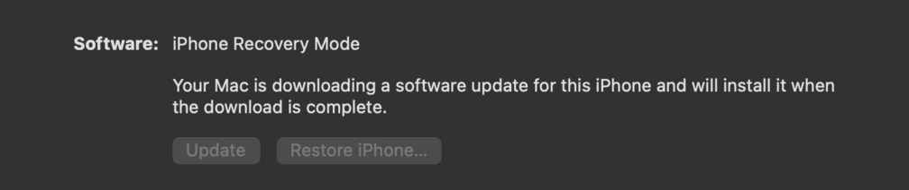
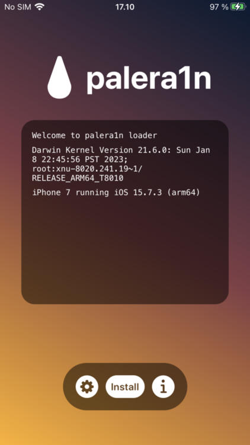

# iOS

## Jaibroken phone, what next?
* Install `PreferenceLoader` from Palera1n repos (DO NOT add extra's for Cydia)
* Install https://github.com/nabla-c0d3/ssl-kill-switch2 using SSH
* Enable/Disable cert validation


## Jailbreaking: Palera1n iOS 15.7.5
*Using iPhone7 with iOS 15.7.3*

### TRY1 - failed
1. (ALWAYS DO THIS 1st!) Old tweaks removed: `sudo ./palera1n.sh --restorerootfs 15.7.3`. At some point same failure as before with 15.7.2 (see below) and `iproxy -s 127.0.0.1 6413:22` in another terminal fixed it
1. iPhone7 was upgaded from 15.7.3 -> 15.7.5
1. Install new: `sudo ./palera1n.sh --tweaks 15.7.5 --semi-tethered`, using manual instructions from `https://ios.cfw.guide/installing-palera1n-legacy/?tab=linux`
1. This time something went terrible wrong over and over again (dafaq!), idevice entered into eternal DFU-loop and had to do forced restore iOS 15.7.5 and factory reset using Mac:


### TRY2 - passed!
1. After above restore, I installed palera1n beta (native binary on ARM macbook): https://ios.cfw.guide/installing-palera1n
1. Ran quick test `palera1n -I` which gave info about iPhone (works)
1. Then final jailbreak and arming:
```
# using recommended command for: "Devices which have iOS 16 or have more than 10-15GB of storage space free should use palera1n -c -f"
$ palera1n -c -f

# == palera1n-c ==
#
# Made by: Nick Chan, Ploosh, Mineek, Nebula, llsc12
#
# Thanks to: dora2ios, pythonplayer, tihmstar, nikias
# (libimobiledevice), checkra1n team (Siguza, axi0mx, littlelailo
# et al.), Procursus Team (Hayden Seay, Cameron Katri, Keto et.al)

 - [04/15/23 19:35:00] <Info>: Waiting for devices
 - [04/15/23 19:35:00] <Info>: Telling device with udid <REDACTED_DEVICE_ID_HERE> to enter recovery mode immediately
 - [04/15/23 19:35:10] <Info>: Press Enter when ready for DFU mode

Get ready (0)
Hold volume down + side button (0)
Hold volume down button (4)
 - [04/15/23 19:35:25] <Info>: Device entered DFU mode successfully
 - [04/15/23 19:35:26] <Info>: About to execute checkra1n
#
# Checkra1n 0.1337.1
#
# Proudly written in nano
# (c) 2019-2023 Kim Jong Cracks
#
#========  Made by  =======
# argp, axi0mx, danyl931, jaywalker, kirb, littlelailo, nitoTV
# never_released, nullpixel, pimskeks, qwertyoruiop, sbingner, siguza
#======== Thanks to =======
# haifisch, jndok, jonseals, xerub, lilstevie, psychotea, sferrini
# Cellebrite (ih8sn0w, cjori, ronyrus et al.)
#==========================

 - [04/15/23 19:35:26] <Verbose>: Starting thread for Apple TV 4K Advanced board
 - [04/15/23 19:35:26] <Info>: Waiting for DFU mode devices
 - [04/15/23 19:35:26] <Verbose>: DFU mode device found
 - [04/15/23 19:35:26] <Info>: Checking if device is ready
 - [04/15/23 19:35:26] <Verbose>: Attempting to perform checkm8 on 8010 11
 - [04/15/23 19:35:26] <Info>: Setting up the exploit
 - [04/15/23 19:35:26] <Verbose>: == checkm8 setup stage ==
 - [04/15/23 19:35:26] <Verbose>: Entered initial checkm8 state after 1 steps
 - [04/15/23 19:35:26] <Verbose>: Stalled input endpoint after 1 steps
 - [04/15/23 19:35:26] <Verbose>: DFU mode device found
 - [04/15/23 19:35:26] <Verbose>: == checkm8 trigger stage ==
 - [04/15/23 19:35:29] <Info>: Checkmate!
 - [04/15/23 19:35:29] <Verbose>: Device should now reconnect in download mode
 - [04/15/23 19:35:29] <Verbose>: DFU mode device disconnected

( AT THIS POINT MANUALLY REMOVED AND REPLUGGED DEVICE AS INSTRUCTED )

 - [04/15/23 19:35:40] <Info>: Entered download mode
 - [04/15/23 19:35:40] <Verbose>: Download mode device found
 - [04/15/23 19:35:40] <Info>: Booting PongoOS...
 - [04/15/23 19:35:42] <Info>: Found PongoOS USB Device
 - [04/15/23 19:35:44] <Info>: Booting Kernel...
 - [04/15/23 19:35:44] <Info>: Please wait up to 10 minutes for the fakefs to be created.
 - [04/15/23 19:35:44] <Info>: Once the device boots up to iOS, run again without the -c (Create FakeFS) option to jailbreak.
 ```

**NOTE 1, VERY IMPORTANT:** Finally run: `palera1n -f` to boot FakeFS (JB/rootful)

**NOTE 2:** Would probably work with Linux too (even easier) but didn't test yet :)


## Jailbreaking: Palera1n iOS 15.7.3
*Using iPhone7 with iOS 15.7.3*



1. (ALWAYS DO THIS 1st!) Old tweaks removed: `sudo ./palera1n.sh --restorerootfs 15.7.2 --tweaks`. At some point same failure as before with 15.7.2 (see below) and `iproxy -s 127.0.0.1 6413:22` in another terminal fixed it
1. iPhone7 had pairing problems and could not be recognized, `idevicepair pair` fixed this:
    ```
    ...
    [*] Waiting for devices
    [*] Detected normal mode device
    ERROR: Could not connect to lockdownd: Invalid HostID (-21)
    ERROR: Could not connect to lockdownd: Invalid HostID (-21)
    ERROR: Could not connect to lockdownd: Invalid HostID (-21)
    ...
    ```
1. iPhone7 was upgaded from 15.7.2 -> 15.7.3
1. Install new: `sudo ./palera1n.sh --tweaks 15.7.3 --semi-tethered`, using manual instructions from `https://ios.cfw.guide/installing-palera1n-legacy/?tab=linux`
1. At some point this error and once again opening iproxy fixed it: `iproxy -s 127.0.0.1 6413:22`
    ```
    ...
    bind(): Address not available
    Error creating socket for listen port 6413: Address not available
    [*] Testing for baseband presence
    ...
    ```
**NOTE 1:**  See logs for full upgrade [here](https://raw.githubusercontent.com/tomikoski/tk0-bugbounty/master/iOS/palera1n-installation-logs-15.7.3.txt).

**NOTE 2:**  If above did not work and you're stuck on older iOS version after Palera1n ("iOS loop"), use iPhone's `Settings -> General -> Erase Content` and repeat

**NOTE 3:** During second time (restart of device) you just need to run single command `sudo ./palera1n.sh --tweaks 15.7.3 --semi-tethered` and semi-tethering will be super fast, under 1 minute (since JB already exists on device)

## Jailbreaking: Palera1n iOS 15.7.2
*Using iPhone7 with iOS 15.7.2*


1. iPhone7 was upgraded from 14.8 -> 15.7.2 :)
1. Follow this Linux-guide: https://appledb.dev/jailbreak/palera1n.html

**NOTE 1:** During installation there was some problems with `usbmuxd` but I got it sorted out when I ran `iproxy` -command, error and command shown below: 
 ```
...
Creating listening port 6413 for device port 22
bind(): Address not available
Error creating socket for listen port 6413: Address not available
...
 ```
 At this point after cold sweats, I just popped another terminal and ran: `iproxy -s 127.0.0.1 6413:22` which continued installation successfully
 

**NOTE 2:** Full logs of this slow'ish but still working proceudure can be seen [here](https://raw.githubusercontent.com/tomikoski/tk0-bugbounty/master/iOS/palera1n-installation-logs.txt)

**NOTE 3:** During second time (restart of device) you just need to run single command `sudo ./palera1n.sh --tweaks 15.7.2 --semi-tethered` and semi-tethering will be super fast, under 1 minute (since JB already exists on device)


## Jailbreaking: checkra1n iOS 14.8
*Using iPhone7 with iOS 14.8*
1. download checkra1n (0.12.4)
1. **preffered** Use Ubuntu (with X and NOT Wayland) - OR - use **INTEL** based macOS or older macOS - latest (2022) doesn't work with Apple M1 at least :[
1. use following settings: 

Problem solving:
* If this doesn't work (exploit does not trigger) - reset iPhone using `erase all content -> everything`. Repeat.
* If Cydia / apt fails - remove from system and rearm using checkra1n

## Decrypting HTTPS traffic
* https://andydavies.me/blog/2019/12/12/capturing-and-decrypting-https-traffic-from-ios-apps/

## Decrypting IPA-files
* When running **iOS 14.8 with checkra1n**, https://github.com/AloneMonkey/frida-ios-dump can be used.
* When running **iOS 15.7.2 with palera1n**, https://github.com/paradiseduo/appdecrypt works (frida-ios-dump crashed my palera1n each time)
* When running **iOS 15.7.3 with palera1n**, once again https://github.com/AloneMonkey/frida-ios-dump can be used :)
