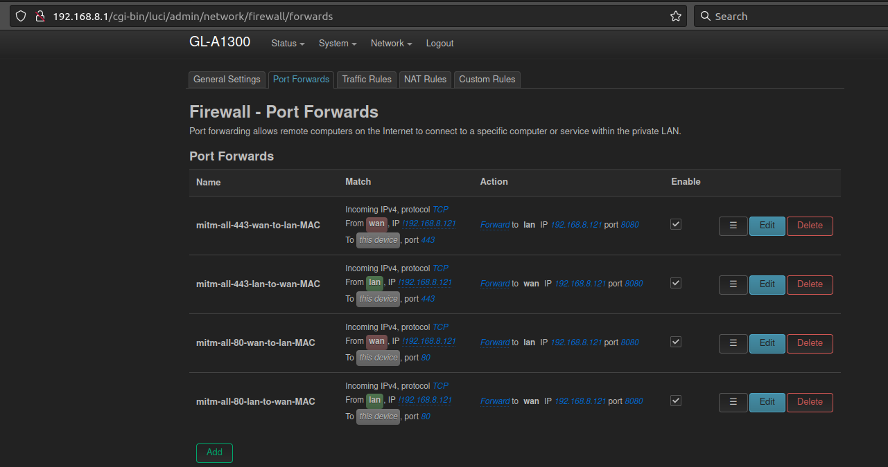

# MITM in general

## Usage of [GL-iNET](https://www.gl-inet.com/products/gl-a1300/)
Setup man-in-the-middle network using external router. Attacks everything except proxy IP.

### MITM using GL-iNET adhoc WiFi for 80/443 - MITM iOS/Android
* Connect existing LAN cable (with internet access) into WAN-port at GL-iNET
* Reset device (push reset for 10 secs) / clean install
* Use in router mode (default)
* Login + set password
* Fix NTP using current network time (via System menu)
* Run following example `ssh root@192.168.8.1 'ash -s' < uci-firewall` or use dynamic output to generate custom list
* Fire up Burp, using invisible proxying with assigned `$DAPROXY` IP as defined in [uci-firewall](https://github.com/tomikoski/tk0-bugbounty/blob/master/mitm-general/uci-firewall), e.g. 192.168.8.121:8080
* Should look in [LUCI OpenWrt](http://192.168.8.1/cgi-bin/luci) something like:

* Connect any victim device into `GL-A1300-20d` or `GL-A1300-20d-5G` WiFi and see traffic in Burp

### MITM using GL-iNET AP WiFi for multiple ports - MITM multiple targets
Setup man-in-the-middle network using external router. Attacks everything except proxy IP.

* Reset device (push reset for 10 secs) / clean install
* Fix NTP using current network time (via System menu)
* Use in AP (access point) mode and attach live ISP cable in WAN
* Connect any victim device into `GL-A1300-20d` or `GL-A1300-20d-5G` WiFi and MITM traffic elsewhere (TO BE UPDATED)

