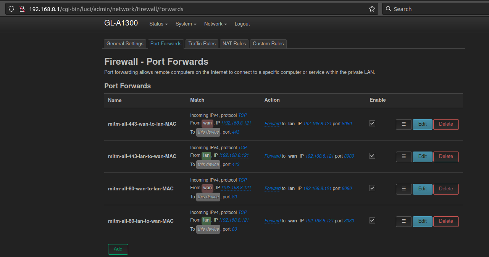

# MITM in general
Setup man-in-the-middle network using external router. Attacks everything except proxy IP.

## Usage of GL-INET Slate
* https://www.gl-inet.com/products/gl-a1300/
* https://www.gl-inet.com/products/gl-be3600/

### MITM using GL-iNET adhoc WiFi for 80/443 - MITM iOS/Android
* Connect existing LAN cable (with internet access) into WAN-port at GL-iNET
* Reset device (push reset for 10 secs) / clean install
* Use in router mode (default)
* Login + set password
* Fix NTP using current network time (via System menu)
* Run following example `ssh root@192.168.8.1 'ash -s' < uci-firewall` or use dynamic output to generate custom list
* Fire up Burp, using invisible proxying with assigned `$DAPROXY` IP as defined in [uci-firewall](https://github.com/tomikoski/tk0-bugbounty/blob/master/mitm-general/uci-firewall), e.g. 192.168.8.121:8080
* Should look in [LUCI OpenWrt](http://192.168.8.1/cgi-bin/luci) something like:

* Connect any victim device into `GL-A1300-20d` or `GL-A1300-20d-5G` WiFi and see traffic in Burp

### MITM using GL-iNET AP WiFi for multiple ports - MITM multiple targets
Setup man-in-the-middle network using external router. Attacks everything except proxy IP.

* Setup some MITM-proxy [certmitm](https://github.com/aapooksman/certmitm)
* Reset device (push reset for 10 secs) / clean install
* Fix NTP using current network time (via System menu)
* Attach **one** attacker machine into AP using Ethernet (due to default bridging rules in certmitm), use WAN in AP
* Use in AP (access point) mode: `Network -> Network mode -> Access Point`
* Connect any victim device into `GL-A1300-20d` or `GL-A1300-20d-5G` WiFi and MITM traffic using [certmitm](https://github.com/aapooksman/certmitm), Burp, mitmproxy etc.
* Traffic should flow something like: VICTIM --> GL-SLATE:WIFI AP --> ATTACKER MACHINE:ETH --> certmitm:ports --> ATTACKER MACHINE:WIFI --> INTERNET
